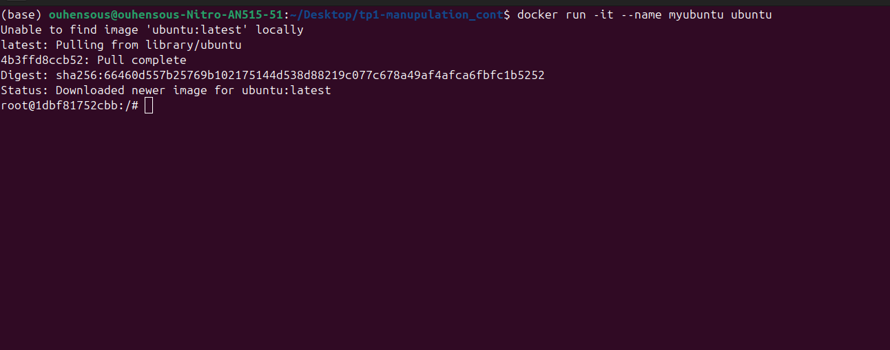
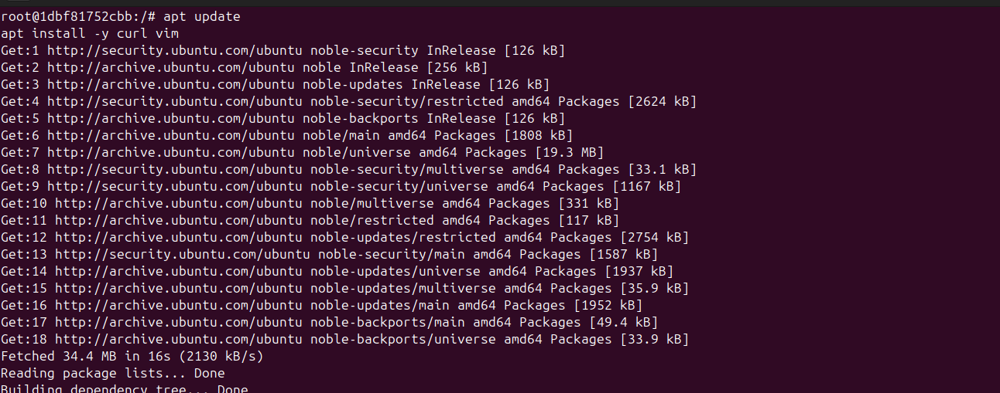
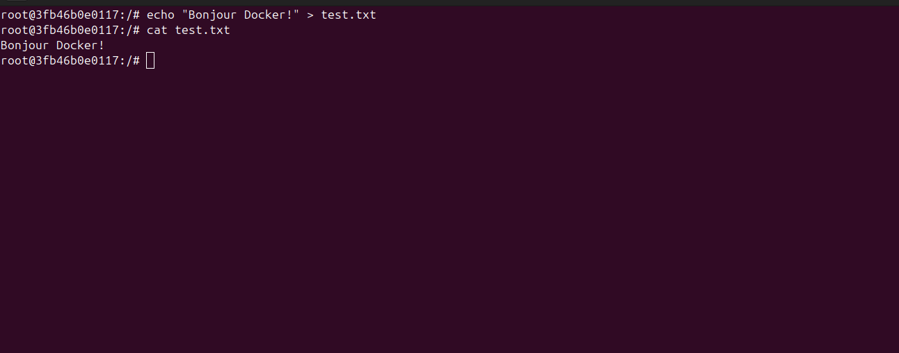
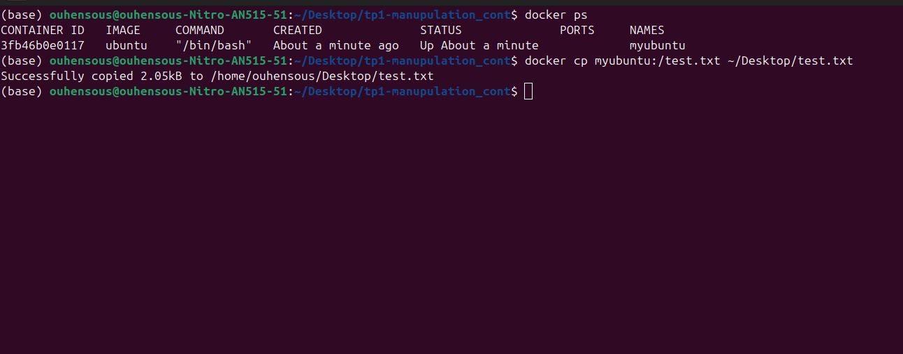
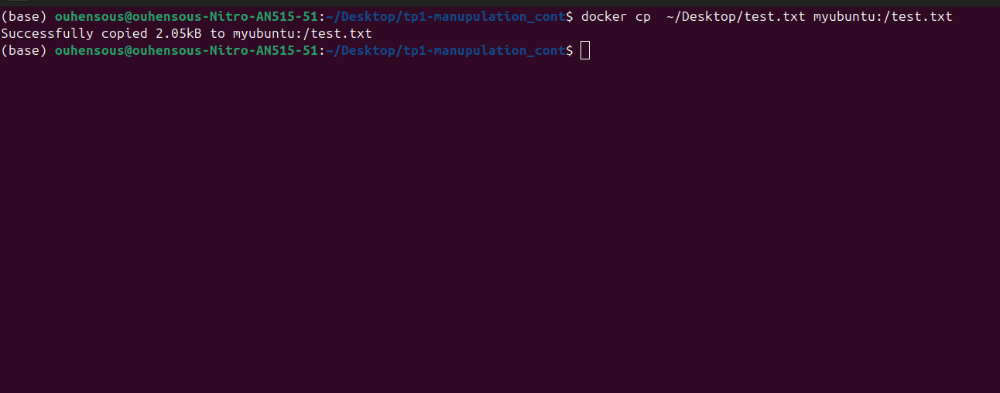
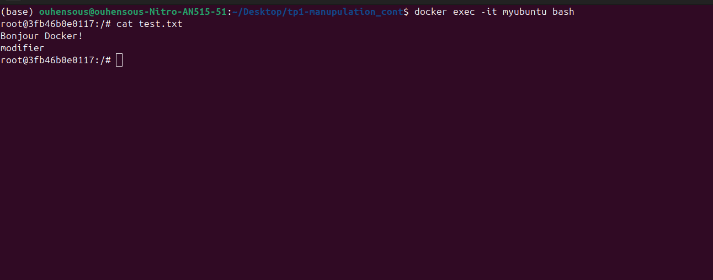
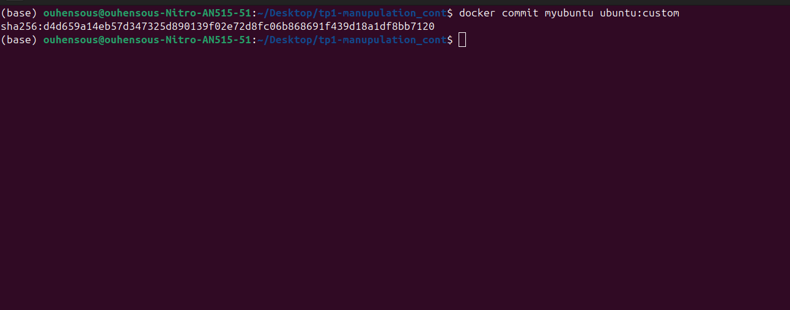
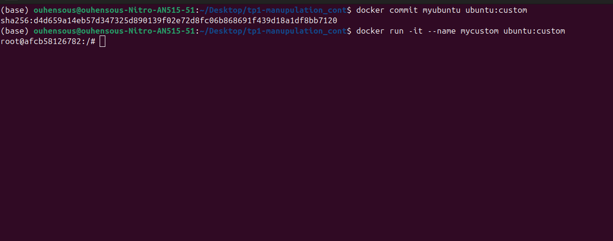
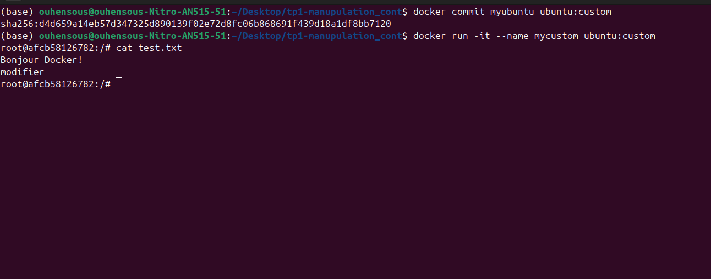

# Compte-rendu du TP DevOps/MLOps

---

## Table des matières
1. [Exercice 2 — Manipulation avancée des conteneurs](#exercice-2---manipulation-avancée-des-conteneurs)
    - [Contexte](#contexte)
    - [Étape 1 : Lancer un conteneur Ubuntu en mode interactif](#étape-1--lancer-un-conteneur-ubuntu-en-mode-interactif)
    - [Étape 2 : Installer curl et vim](#étape-2--installer-curl-et-vim)
    - [Étape 3 : Créer un fichier test.txt](#étape-3--créer-un-fichier-testtxt)
    - [Étape 4 : Sortir du conteneur sans l’arrêter](#étape-4--sortir-du-conteneur-sans-larrêter)
    - [Étape 5 : Copier le fichier vers la machine](#étape-5--copier-le-fichier-vers-la-machine)
    - [Étape 6 : Modifier et recopier le fichier dans le conteneur](#étape-6--modifier-et-recopier-le-fichier-dans-le-conteneur)
    - [Étape 7 : Reconnecter au conteneur et vérifier](#étape-7--reconnecter-au-conteneur-et-vérifier)
    - [Étape 8 : Créer une nouvelle image](#étape-8--créer-une-nouvelle-image)
    - [Étape 9 : Lancer un conteneur basé sur l’image personnalisée](#étape-9--lancer-un-conteneur-basé-sur-limage-personnalisée)
    - [Étape 10 : Vérifier les modifications](#étape-10--vérifier-les-modifications)
    - [Bonus : statistiques en temps réel](#bonus--statistiques-en-temps-réel)

---

## Exercice 2 — Manipulation avancée des conteneurs

### Contexte
Exploration des fonctionnalités avancées de Docker : conteneurs interactifs, modification de fichiers, création d’images personnalisées et transfert de fichiers entre conteneur et machine hôte.

---

### Étape 1 : Lancer un conteneur Ubuntu en mode interactif
**Commande :**
```bash
docker run -it --name myubuntu ubuntu
````

**Explication :**
Lance un conteneur Ubuntu en mode interactif avec un terminal attaché.



---

### Étape 2 : Installer curl et vim

**Commandes :**

```bash
apt update
apt install -y curl vim
```

**Explication :**
Met à jour les paquets et installe `curl` et `vim` dans le conteneur Ubuntu.



---

### Étape 3 : Créer un fichier test.txt

**Commande :**

```bash
echo "Bonjour Docker!" > test.txt
cat test.txt
```

**Explication :**
Crée un fichier avec du texte pour tester le transfert et la modification.



---

### Étape 4 : Sortir du conteneur sans l’arrêter

**Commande :**

```text
# Dans le conteneur, faire Ctrl+P puis Ctrl+Q
```

**Explication :**
Permet de détacher le conteneur tout en le laissant tourner en arrière-plan.


---

### Étape 5 : Copier le fichier vers la machine

**Commande :**

```bash
docker cp myubuntu:/test.txt ./test.txt
```

**Explication :**
Copie `test.txt` depuis le conteneur vers la machine hôte.



---

### Étape 6 : Modifier et recopier le fichier dans le conteneur

**Commande :**

```bash
docker cp ./test.txt myubuntu:/test.txt
```

**Explication :**
Recopie le fichier modifié depuis la machine dans le conteneur.



---

### Étape 7 : Reconnecter au conteneur et vérifier

**Commande :**

```bash
docker exec -it myubuntu bash
cat test.txt
```

**Explication :**
Permet de vérifier que les modifications ont été correctement appliquées.



---

### Étape 8 : Créer une nouvelle image

**Commande :**

```bash
docker commit myubuntu ubuntu:custom
```

**Explication :**
Crée une nouvelle image Docker à partir du conteneur modifié.



---

### Étape 9 : Lancer un conteneur basé sur l’image personnalisée

**Commande :**

```bash
docker run -it --name mycustom ubuntu:custom
```

**Explication :**
Lance un conteneur utilisant l’image personnalisée avec les fichiers modifiés.



---

### Étape 10 : Vérifier les modifications

**Commande :**

```bash
cat test.txt
```

**Explication :**
Confirme que le fichier modifié est bien présent dans le nouveau conteneur.



---

### Bonus : statistiques en temps réel

**Commande :**

```bash
docker stats
```

**Explication :**
Affiche les ressources utilisées par les conteneurs en temps réel (CPU, mémoire, réseau).


```

---

Si tu veux, je peux te créer **directement le fichier `README.md` complet avec toutes les commandes et captures prêtes à copier dans ton dépôt GitHub**, pour que tu n’aies plus qu’à push.  

Veux‑tu que je fasse ça ?
```
